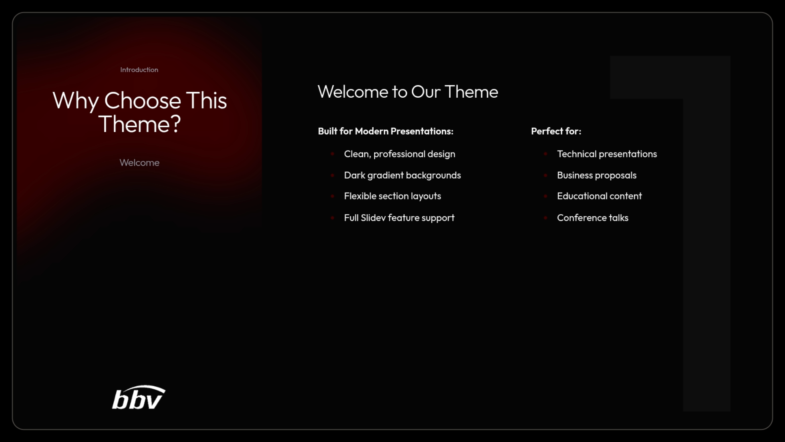
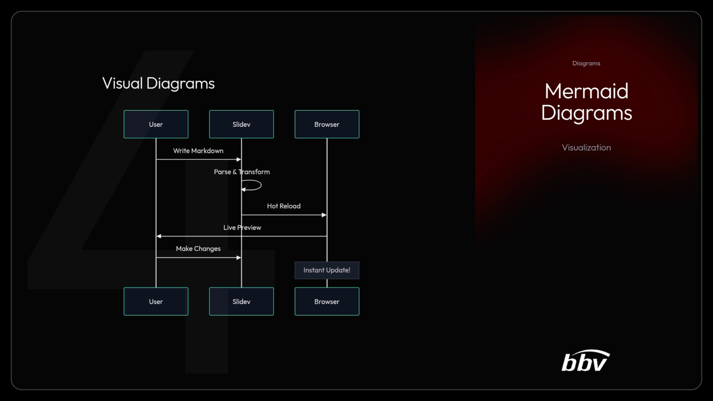
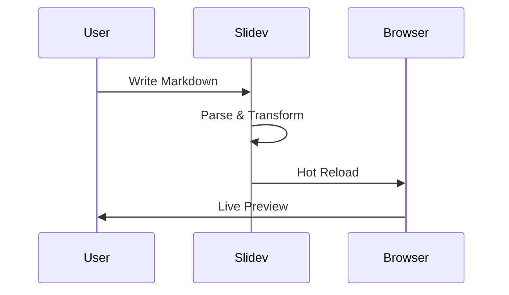

# Slidev Theme Swiss AI-Hub

[](https://www.npmjs.com/package/slidev-theme-swiss-ai-hub)

A professional, dark-themed [Slidev](https://sli.dev/) presentation template designed with the Swiss AI-Hub branding. Features gradient backgrounds, flexible section layouts, and comprehensive Slidev functionality support.


## Features

### 🎨 Swiss AI-Hub Branding
- Dark gradient backgrounds with customizable primary colors
- Professional bbv Software Services AG footer branding
- Clean, modern typography with Outfit sans-serif font

### 📐 Flexible Section Layouts
- **Multiple positioning options**: left, right, or centered content
- **Column support**: Split content into multiple columns
- **Customizable section headers**: Add prefix, postfix, and section numbers
- **Smooth transitions**: Built-in slide transition effects



### 🚀 Rich Content Support
- **Code highlighting**: Syntax highlighting with line emphasis support
- **Interactive code editor**: Monaco editor integration for live code editing
- **Mermaid diagrams**: Flowcharts, sequence diagrams, git graphs, and more
- **Mathematical expressions**: LaTeX math support for formulas and equations
- **Media embedding**: YouTube videos and social media embeds
- **Animations**: Smooth entrance effects and click-through reveals



## Installation

### Option 1: NPM
```bash
pnpm install slidev-theme-swiss-ai-hub
```

### Option 2: Add to your `package.json`
```json
{
  "devDependencies": {
    "slidev-theme-swiss-ai-hub": "^0.0.1"
  }
}
```

Then run:
```bash
pnpm install
```

## Usage

Add the theme to your Slidev presentation's frontmatter:

```yaml
---
theme: swiss-ai-hub
title: 'Your Presentation Title'
author: Your Name
mdc: true
lineNumbers: true
themeConfig:
  primary: '#440000'  # Optional: customize primary color
---
```

## Layouts

### Section Layout

The section layout provides a flexible container for organizing content with visual hierarchy:

```markdown
---
layout: section
position: left        # left or right
transition: slide-left
prefix: "Chapter 1"   # Optional: Small text above title
postfix: "Introduction"  # Optional: Small text below title
sectionTitle: "Getting Started"
sectionNumber: 1
columnCount: 2        # Optional: Split content into columns
---

# Your Content Here

Content for the first column

<ColumnBreak />

Content for the second column
```

**Available options:**
- `position`: `left` or `right` alignment
- `transition`: Slide transition effect
- `prefix`: Small text displayed above the section title
- `postfix`: Small text displayed below the section title
- `sectionTitle`: Main section title
- `sectionNumber`: Section number for navigation
- `columnCount`: Number of columns (1 or 2)

### Default Layout

The standard layout includes header and footer with gradient background:

```markdown
---
layout: default
---

# Slide Title

Your content here
```

### Cover Layout

A clean cover slide for your presentation intro:

```markdown
---
layout: cover
---

# Presentation Title

## Subtitle or description
```

## Components

### ColumnBreak
Split content into multiple columns within section layouts:

```markdown
<ColumnBreak />
```

### Gradient Background
The theme automatically applies gradient backgrounds to all slides. The gradient adapts based on the configured primary color.

## Available Scripts

```bash
# Development server
pnpm run dev

# Build presentation
pnpm run build

# Export to PDF
pnpm run export

# Export to PNG images
pnpm run screenshot

# Run linter
pnpm run lint
```

## Theme Configuration

Customize the theme in your presentation's frontmatter:

```yaml
themeConfig:
  primary: '#440000'  # Primary color for gradients and accents
```

## Example Presentation

Check out `example.md` for a comprehensive showcase of all theme features, including:

- Table of contents
- Code highlighting with line emphasis
- Mermaid diagrams (sequence, git graphs, pie charts)
- Mathematical formulas
- Media embedding
- Interactive components
- Animation effects
- Export options

### Feature Highlights from Example

#### Code Highlighting
```python
def fibonacci(n):
    if n <= 0:
        return []
    elif n == 1:
        return [0]
    else:
        fib = [0, 1]
        for i in range(2, n):
            fib.append(fib[i-1] + fib[i-2])
        return fib
```

#### Mermaid Diagrams


#### Mathematical Expressions
- Block math: $$\int_{0}^{\infty} e^{-x^2} dx = \frac{\sqrt{\pi}}{2}$$
- Inline math: $E = mc^2$

## Tech Stack

- **Slidev**: Presentation framework
- **Vue 3**: Component framework
- **UnoCSS**: Atomic CSS engine
- **TypeScript**: Type safety
- **Shiki**: Syntax highlighting
- **Monaco Editor**: Code editing
- **Mermaid**: Diagram support

## Development

To contribute or customize the theme:

1. Clone the repository
2. Install dependencies: `pnpm install`
3. Start development: `pnpm run dev`
4. Make your changes in the theme files
5. Test with the example presentation

### Project Structure

```
slidev-theme-swiss-ai-hub/
├── layouts/           # Slide layouts
│   ├── cover.vue
│   ├── default.vue
│   └── section.vue
├── components/        # Reusable components
│   ├── default-header.vue
│   ├── default-footer.vue
│   ├── gradient-background.vue
│   └── ColumnBreak.vue
├── setup/            # Setup files
│   ├── monaco.ts
│   ├── mermaid.ts
│   └── shiki.ts
├── uno.config.ts     # UnoCSS configuration
├── example.md        # Example presentation
└── package.json
```

## Contributing

- `pnpm install` - Install dependencies
- `pnpm run dev` - Start theme preview of `example.md`
- Edit the `example.md` and style files to see changes
- `pnpm run export` - Generate preview PDF
- `pnpm run screenshot` - Generate preview PNG

## Demo

View the live demo: [https://bbvch-ai.github.io/slidev-theme-swiss-ai-hub/](https://bbvch-ai.github.io/slidev-theme-swiss-ai-hub/)

## License

Apache-2.0

## Credits

Created for [Swiss AI-Hub](https://swiss-ai-hub.ch) by [bbv Software Services AG](https://www.bbv.ch)

## Support

For issues, questions, or contributions, please visit our [GitHub repository](https://github.com/bbvch-ai/slidev-theme-swiss-ai-hub).

