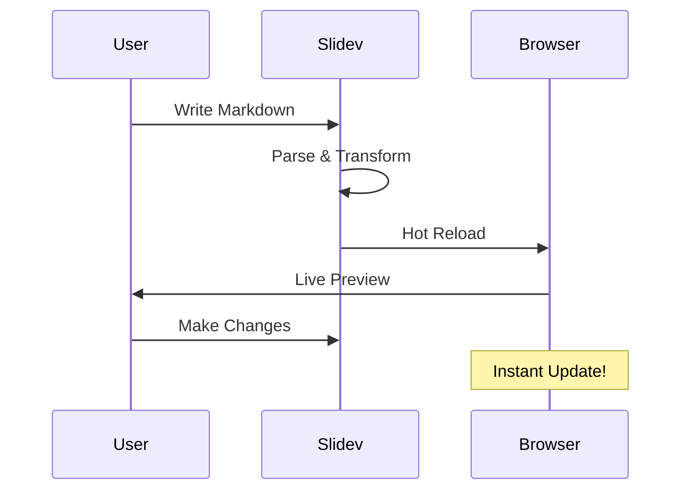
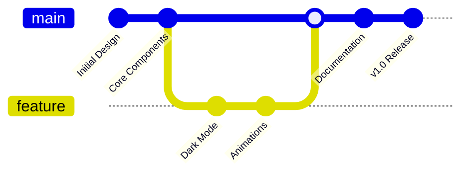
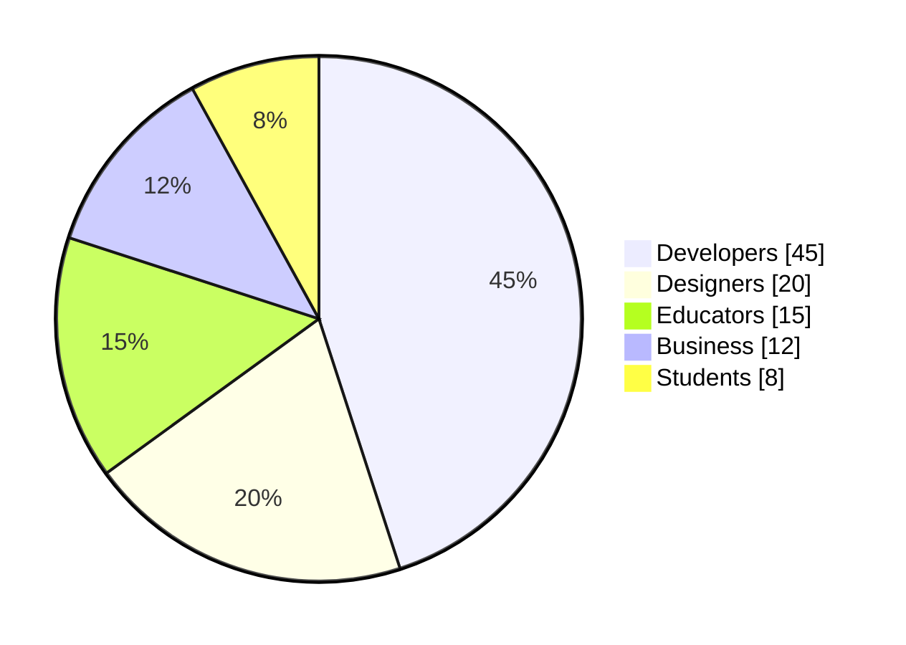

# Swiss AI-Hub Theme

## Built in the Swiss AI-Hub Brand

---

<Toc list-class="text-white" />

---
layout: section
position: left
transition: slide-left
prefix: "Introduction"
postfix: "Welcome"
sectionTitle: "Why Choose This Theme?"
sectionNumber: 1
columnCount: 2
---

# Welcome to Our Theme

**Built for Modern Presentations:**

- Clean, professional design
- Dark gradient backgrounds
- Flexible section layouts
- Full Slidev feature support

<ColumnBreak />

**Perfect for:**

- Technical presentations
- Business proposals
- Educational content
- Conference talks


---
layout: section
position: right
transition: slide-left
prefix: "Features"
postfix: "Code Support"
sectionTitle: "Syntax Highlighting"
sectionNumber: 2
---

# Code Highlighting

<v-clicks>

```python {2-4|6-7|all}
def fibonacci(n):
    if n <= 0:
        return []
    elif n == 1:
        return [0]
    else:
        fib = [0, 1]
        for i in range(2, n):
            fib.append(fib[i-1] + fib[i-2])
        return fib
```

**Features:** Line highlighting • Multiple languages • Theme support

</v-clicks>

---
layout: section
position: left
transition: slide-left
prefix: "Media"
postfix: "Rich Content"
sectionTitle: "Embedded Media & Videos"
sectionNumber: 3
---

# Rich Media Support


<Youtube id="dQw4w9WgXcQ" width="400" height="225" />

---
layout: section
position: right
transition: slide-left
prefix: "Diagrams"
postfix: "Visualization"
sectionTitle: "Mermaid Diagrams"
sectionNumber: 4
---

# Visual Diagrams

<v-clicks>



</v-clicks>

---
layout: section
position: left
transition: slide-left
prefix: "Annotations"
postfix: "Visual Guides"
sectionTitle: "Arrows & Annotations"
sectionNumber: 5
---

# Visual Annotations

<v-clicks>

<div class="grid grid-cols-2 gap-8">
<div>

### Key Feature
Content goes here

</div>
<div>

### Important Note
More content here

</div>
</div>

</v-clicks>

<v-click>

<Arrow x1="200" y1="250" x2="350" y2="180" />

</v-click>

<v-click>

<Arrow x1="550" y1="250" x2="400" y2="180" color="red" />

</v-click>

---
layout: section
position: right
transition: slide-left
prefix: "Tables"
postfix: "Data Display"
sectionTitle: "Data Presentation"
sectionNumber: 6
columnCount: 2
---

# Performance Metrics

| Framework | Build Time | Bundle Size |
|-----------|------------|-------------|
| Slidev    | 0.5s       | 450 KB      |
| PowerPoint| N/A        | 2.5 MB      |
| Keynote   | N/A        | 3.1 MB      |

<ColumnBreak />

<v-clicks>

**Advantages:**
- Lightning fast
- Minimal size
- Git-friendly
- Version control

</v-clicks>

---
layout: section
position: left
transition: slide-left
prefix: "Interactive"
postfix: "Components"
sectionTitle: "Interactive Elements"
sectionNumber: 7
---

# Interactive Code

<v-clicks>

```ts {monaco}
// Try editing this code!
interface Presenter {
  name: string
  slides: number
  awesome: boolean
}

const myPresentation: Presenter = {
  name: "Slidev Theme Demo",
  slides: 15,
  awesome: true
}

console.log(myPresentation)
```

</v-clicks>

---
layout: section
position: right
transition: slide-left
prefix: "Timeline"
postfix: "Roadmap"
sectionTitle: "Project Timeline"
sectionNumber: 8
---

# Development Journey

<v-clicks>



</v-clicks>

---
layout: section
position: left
transition: slide-left
prefix: "Analytics"
postfix: "Insights"
sectionTitle: "Usage Statistics"
sectionNumber: 9
columnCount: 1
---

# Theme Analytics



---
layout: section
position: right
transition: slide-left
prefix: "Mathematics"
postfix: "Formulas"
sectionTitle: "Mathematical Expressions"
sectionNumber: 10
---

# Mathematical Support

<v-clicks>

**Block Math:**

$$
\int_{0}^{\infty} e^{-x^2} dx = \frac{\sqrt{\pi}}{2}
$$

**Inline Math:** The formula $E = mc^2$ changed physics forever.

**Matrix:**

$$
\begin{bmatrix}
a & b \\
c & d
\end{bmatrix}
$$

</v-clicks>

---
layout: section
position: left
transition: slide-left
prefix: "Presenter"
postfix: "Mode"
sectionTitle: "Presenter View"
sectionNumber: 11
columnCount: 2
---

# Presenter Features

**Speaker Notes:**

Press `Shift + Enter` to toggle presenter mode

<v-clicks>

- Timer display
- Next slide preview
- Notes section
- Current slide number

</v-clicks>

<ColumnBreak />

**Shortcuts:**

<v-clicks>

- `f` - fullscreen
- `g` - go to slide
- `d` - toggle dark
- `o` - overview mode

</v-clicks>

<!--
These are presenter notes!
They won't be visible to the audience.
Perfect for reminders and talking points.
-->

---
layout: section
position: right
transition: slide-left
prefix: "Components"
postfix: "Built-in"
sectionTitle: "Slidev Components"
sectionNumber: 12
---

# Built-in Components

<v-clicks>

<Tweet id="1390115482657726468" />

</v-clicks>

---
layout: section
position: left
transition: slide-left
prefix: "Export"
postfix: "Options"
sectionTitle: "Export Formats"
sectionNumber: 13
columnCount: 2
---

# Export Options

<v-clicks>

**Formats:**
- PDF slides
- PDF with notes
- PNG images
- Single-page app
- Markdown

</v-clicks>

<ColumnBreak />

<v-clicks>

**Commands:**
```bash
# Export to PDF
slidev export

# With notes
slidev export --with-clicks

# As images
slidev export --format png
```

</v-clicks>

---
layout: section
position: right
transition: slide-left
prefix: "Advanced"
postfix: "Techniques"
sectionTitle: "Animation & Motion"
sectionNumber: 14
---

# Smooth Animations

<div v-motion
  :initial="{ x: -80, opacity: 0 }"
  :enter="{ x: 0, opacity: 1 }">

## Entrance Effects

</div>

<v-clicks>

<div v-motion
  :initial="{ y: 40, opacity: 0 }"
  :enter="{ y: 0, opacity: 1 }">

- Slide transitions
- Element animations
- Hover states

</div>

<div v-motion
  :initial="{ scale: 0.5 }"
  :enter="{ scale: 1 }">

**Make presentations dynamic!**

</div>

</v-clicks>

---
layout: section
position: left
transition: slide-left
prefix: "Conclusion"
postfix: "Thank You"
sectionTitle: "Start Building Today"
sectionNumber: 15
columnCount: 2
---

# Ready to Create?

<v-clicks>

**Quick Start:**
```bash
npm init slidev
npm install theme
npm run dev
```

**Resources:**
- [Documentation](#)
- [Examples](#)
- [Discord](#)

</v-clicks>

<ColumnBreak />

<v-clicks>

**Features:**
- 🚀 Fast refresh
- 📝 Markdown
- 🎨 Themes
- 🧑‍💻 Code blocks
- 📊 Diagrams
- 🎥 Media
- ✨ Animations

**Thank you!**

</v-clicks>
